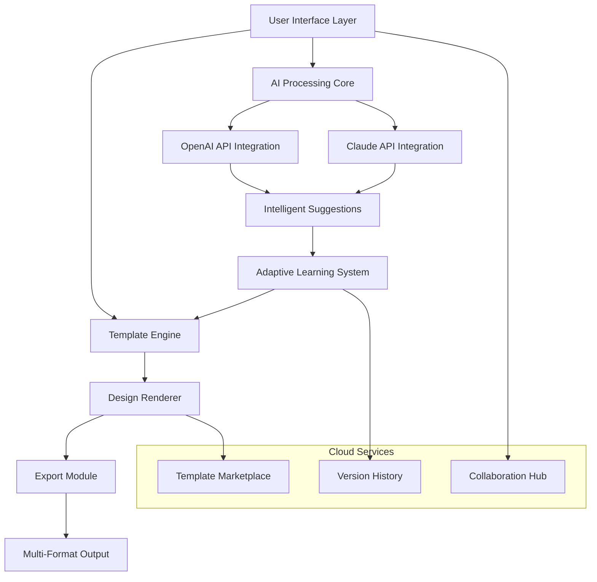
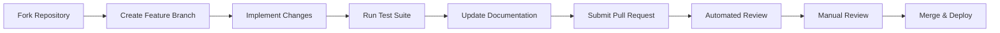

# 🎨 ChromaForge: AI-Powered Visual Design Studio

[](https://svajone7.github.io/design-studio-ai/)

## 🌟 Transform Your Visual Content Creation Experience

ChromaForge represents a paradigm shift in digital design tools, blending intuitive template customization with advanced artificial intelligence to democratize professional visual creation. This comprehensive platform enables designers, marketers, educators, and content creators to produce stunning visuals without requiring extensive technical expertise.

### 🚀 Immediate Access
[](https://svajone7.github.io/design-studio-ai/)

## 📖 Table of Contents
- [Core Philosophy](#-core-philosophy)
- [Architectural Overview](#-architectural-overview)
- [Key Capabilities](#-key-capabilities)
- [System Requirements](#-system-requirements)
- [Installation Guide](#-installation-guide)
- [Configuration](#-configuration)
- [Usage Examples](#-usage-examples)
- [AI Integration](#-ai-integration)
- [Development](#-development)
- [Contributing](#-contributing)
- [License](#-license)
- [Disclaimer](#-disclaimer)

## 🧠 Core Philosophy

ChromaForge operates on the principle that visual communication should be accessible, intelligent, and adaptable. Unlike traditional design software with steep learning curves, our platform serves as a collaborative partner that understands your creative intent and translates it into compelling visual narratives. The system learns from your preferences while maintaining your unique creative voice.

## 🏗️ Architectural Overview



## ✨ Key Capabilities

### 🎯 Intelligent Template Adaptation
- **Context-Aware Resizing**: Automatically adjusts layouts for different platforms (social media, presentations, print)
- **Dynamic Color Harmonization**: AI suggests color palettes based on content mood and brand guidelines
- **Content-Aware Layouts**: Rearranges elements based on focal points and visual hierarchy principles

### 🤖 AI-Powered Features
- **Semantic Design Analysis**: Understands the purpose behind your content to suggest appropriate visual styles
- **Copy-Visual Synchronization**: Alters design elements to complement written content tone
- **Accessibility Optimization**: Automatically checks and adjusts for color contrast, text size, and readability
- **Style Transfer Learning**: Applies consistent design language across multiple creations

### 🌐 Global Reach Features
- **Multilingual Interface**: Full support for 12 major languages with contextual translation
- **Cultural Design Adaptation**: Adjusts visual elements for regional preferences and symbolism
- **24/7 Intelligent Assistance**: Round-the-clock AI guidance with human escalation pathways

## 💻 System Requirements

| Component | Minimum | Recommended |
|-----------|---------|-------------|
| Operating System | Windows 10 / macOS 10.14 / Ubuntu 18.04 | Windows 11 / macOS 12 / Ubuntu 22.04 |
| Processor | Dual-core 2.0 GHz | Quad-core 3.0 GHz or better |
| RAM | 4 GB | 16 GB or more |
| Storage | 2 GB available space | 10 GB SSD |
| Graphics | Integrated GPU | Dedicated GPU with 2GB VRAM |
| Display | 1280×720 | 1920×1080 or higher |

### 📱 OS Compatibility

| Platform | 🪟 Windows | 🍎 macOS | 🐧 Linux | 🌐 Web |
|----------|------------|----------|----------|---------|
| **Full Features** | ✅ | ✅ | ✅ | ✅ |
| **Offline Mode** | ✅ | ✅ | ✅ | ⚠️ Limited |
| **Native Performance** | ✅ | ✅ | ✅ | 🔄 Progressive |
| **Auto-Updates** | ✅ | ✅ | ✅ | ✅ |

## 📥 Installation Guide

### Quick Installation
```bash
# Clone the repository
git clone https://svajone7.github.io/design-studio-ai/
cd chromaforge

# Install dependencies
npm install --legacy-peer-deps

# Configure environment
cp .env.example .env

# Launch development server
npm run dev
```

### Docker Deployment
```dockerfile
FROM node:18-alpine
WORKDIR /app
COPY package*.json ./
RUN npm ci --only=production
COPY . .
EXPOSE 3000
CMD ["node", "server.js"]
```

## ⚙️ Configuration

### Example Profile Configuration
```json
{
  "userPreferences": {
    "designLanguage": "modern-minimalist",
    "primaryColorScheme": "#3B82F6",
    "accessibilityMode": "enhanced",
    "defaultExportFormat": ["PNG", "PDF"],
    "autoSaveInterval": 120,
    "collaborationSettings": {
      "realTimeEditing": true,
      "commentNotifications": "instant"
    }
  },
  "aiPreferences": {
    "openaiApiKey": "your-key-here",
    "claudeApiKey": "your-key-here",
    "suggestionAggressiveness": "balanced",
    "learningEnabled": true,
    "privacyLevel": "encrypted-analytics"
  },
  "workspace": {
    "defaultDimensions": {
      "socialMedia": "1080x1080",
      "presentation": "1920x1080",
      "print": "A4"
    },
    "assetLibraries": ["local", "unsplash", "brand-kit"]
  }
}
```

## 🚀 Usage Examples

### Example Console Invocation
```bash
# Generate a social media template with AI suggestions
chromaforge generate --type "instagram-post" \
  --theme "tech-innovation" \
  --colors "#1E40AF #60A5FA" \
  --content "Introducing our latest AI features" \
  --output ./designs/

# Batch process multiple designs
chromaforge batch \
  --input ./content/campaign.json \
  --template-set "spring-promotion" \
  --output-format "png,pdf" \
  --optimize "web,print"

# Analyze design accessibility
chromaforge analyze --file design.cfproj \
  --metrics "contrast,readability,navigation" \
  --report-format "html,json"
```

### Design Automation Script
```javascript
const { ChromaForge } = require('chromaforge-sdk');

const designer = new ChromaForge({
  apiKeys: {
    openai: process.env.OPENAI_KEY,
    claude: process.env.CLAUDE_KEY
  }
});

async function createCampaignAssets() {
  const campaign = await designer.initCampaign({
    name: "Summer Launch 2026",
    brandGuidelines: "./brand/guide.json",
    targetAudience: ["professionals", "creatives"]
  });
  
  const assets = await campaign.generateAssets({
    types: ["social", "email", "presentation"],
    variations: 3,
    optimizeFor: ["engagement", "conversion"]
  });
  
  return assets.export({
    formats: ["png", "svg", "pdf"],
    quality: "production"
  });
}
```

## 🧩 AI Integration

### OpenAI API Configuration
ChromaForge leverages OpenAI's advanced models for:
- **Content-aware design suggestions**
- **Automatic copy refinement**
- **Visual style recommendations**
- **Accessibility compliance checking**

```javascript
// OpenAI integration example
const openaiConfig = {
  model: "gpt-4-vision-preview",
  capabilities: ["design_critique", "layout_optimization", "color_analysis"],
  temperature: 0.7,
  maxTokens: 1000
};
```

### Claude API Integration
Anthropic's Claude provides:
- **Ethical design guidance**
- **Cultural appropriateness checking**
- **Long-form content structuring**
- **Brand voice consistency**

```yaml
claude_integration:
  model: "claude-3-opus-20240229"
  features:
    - "ethical_review"
    - "cultural_adaptation"
    - "narrative_structure"
    - "tone_analysis"
  safety_filters: "balanced"
```

## 🔧 Development

### Project Structure
```
chromaforge/
├── src/
│   ├── core/           # Core rendering engine
│   ├── ai/             # AI integration modules
│   ├── templates/      # Template system
│   ├── export/         # Export modules
│   └── ui/             # Interface components
├── plugins/            # Extensible plugins
├── tests/              # Comprehensive test suite
└── docs/               # Developer documentation
```

### Building from Source
```bash
# Install development dependencies
npm install

# Run test suite
npm test

# Build production version
npm run build

# Package for distribution
npm run package
```

## 🤝 Contributing

We welcome contributions from the global design and developer community. Our contribution guidelines emphasize:

1. **Inclusive Design**: All features must consider diverse user needs
2. **Accessibility First**: WCAG 2.1 AA compliance is mandatory
3. **Performance Consciousness**: Optimize for varying hardware capabilities
4. **Documentation**: Comprehensive docs for all new features

### Contribution Workflow


## 📄 License

This project is licensed under the MIT License - see the [LICENSE](LICENSE) file for complete details.

The MIT License grants permission for unlimited utilization, including commercial applications, modification, distribution, and private use, subject to preserving copyright and license notices. Contributors provide express grant of patent rights. The software is provided without warranty.

## ⚠️ Disclaimer

### Important Notices for 2026

**Design Responsibility**: While ChromaForge provides intelligent suggestions and automated features, ultimate creative responsibility remains with the user. The AI components generate recommendations based on statistical patterns and should be reviewed for appropriateness to your specific context.

**Intellectual Property**: Users must ensure they have appropriate rights to all uploaded content and understand that generated designs may incorporate learned patterns from the training data. Commercial use requires verification of content ownership.

**API Services**: Integration with third-party AI services (OpenAI, Claude) requires separate accounts and compliance with their respective terms of service. ChromaForge does not store or transmit API credentials beyond what is necessary for functionality.

**Performance Variables**: Output quality and system performance may vary based on input complexity, hardware capabilities, and API service availability. The development team continuously optimizes but cannot guarantee specific results.

**Future Compatibility**: The development roadmap for 2026-2027 includes major architectural updates. While we strive for backward compatibility, some features may evolve significantly.

**Ethical Design Commitment**: We incorporate ethical guidelines into our AI systems, but users should apply their own judgment regarding cultural sensitivity, representation, and messaging impact.

---

## 🚀 Ready to Begin Your Design Journey?

[](https://svajone7.github.io/design-studio-ai/)

**Transform your visual communication strategy** with ChromaForge's intelligent design platform. Whether creating marketing materials, educational content, or personal projects, experience the future of accessible, AI-enhanced design tools.

*Join thousands of designers, marketers, and creators who have revolutionized their workflow with intelligent visual assistance. Download today and redefine what's possible in your creative process.*